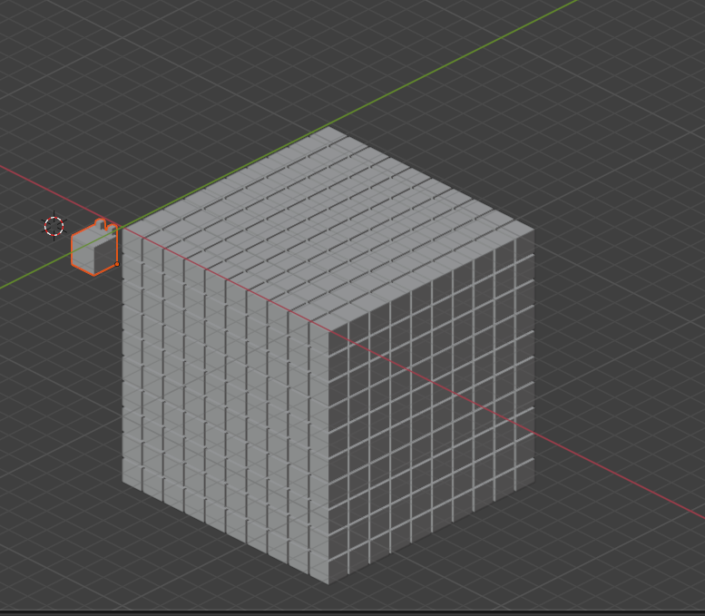

# Juego interactivo web de aprendizaje de programación mediante edición de vóxeles (manuel.santamarina, v.druiz)

Nuestra propuesta consiste en un juego de aprendizaje de programación que
permite a través de un cliente web escribir código que luego será interpretad
 y procesado por un cursor que se moverá a través de él generando, pintando
 eliminando bloques. El escenario consiste de un espacio geométrico de n
 bloques que podrán contener cualquier valor RGBA escrito en hexadecimal
 siendo el 00 absoluto en el canal alfa equivalente a la no existencia de
 bloque en esas coordenadas. 

Los bloques estarán ordenados en base a un espacio de coordenadas de man
 izquierda, siendo inicialmente la esquina presente a la izquierda en l
 figura 1 el origen de coordenadas del escenario, creciendo hacia la derech
 la X y la Y, y la Z decreciendo hacia abajo.

En cuanto al lenguaje, tendremos una serie de instrucciones básicas de
movimiento del "cursor" (que estará representado por un modelo más amigable).

Nuestro compilador, que estará compilado a WebAssembly a partir de la salida
de BISON, generará una lista de estados que serán visualizados y renderizados
en la web.

Para interactuar con el estado, usarán built-ins:
- Mover
  - Arriba
  - Abajo
  - Izquierda
  - Derecha
  - Adelante
  - Atras
- Modificar cubo (RGBA)

Aparte de eso, mecanismos para hacer bucles y condicionales.
- Ejecución condicional
- Iteración

Nuestro lenguaje no cuenta con booleanos explícitamente, sino que los
condicionales se evalúan y controlan la ejecución sin hacer una reducción a
true o false.

Trataremos todos los errores sintácticos y semánticos que detectemos a través
de feedback de cara al usuario a través de la UI, indicando la línea que
produce el error. En vez de mandar el mensaje con la representación del estado
 al código JavaScript, tendremos mensajes especiales para señalar el error.

# Ficheros
La práctica se compone de 2 partes: front y back

El back tiene los siguientes archivos
- api : interactuar con el front
- ast : arbol de sintaxis 
- types : tipos e implementaciones
- fat_array : arrays que llevan cuenta de su tamaño
- codevoxels.l -> lex
- codevoxels.y -> syn
- codevoxels.c : ejecutar sin el front

El front tiene

# Compilación
El fichero Makefile tiene los siguientes comandos

init : para instalar las dependencias (solo funciona si se usa nix)
gen : genera los archivos de bison y flex
compile : compila a wasm
run : ejecuta el front

compile-local : compila el back para ejecución sin front
run-local : ejecuta el back pidiendo pasando un archivo de ejemplo por stdin

debug : para debugear el back

clean : limpia los archivos generados por la compilación

# Analizador lexico
Acepta los tokens básicos del lenguaje, nombres, y numeros.
Tambien guarda las posición del token.

# Analizador sintactico
Utiliza una cadena de reglas para asignar la prioridad a ciertas operaciones
simp > call > mul > sum > branch & loop

Las funciones pueden tener varargs, o no tener parametros.

En el top level solo pueden ir definiciones
Tambien soporta errores a la hora de encadenar elementos, por ejemplo, si
multiplicas varias cosas pero una de ellas es un error sintactica simplemente
se ignora

# Online
Para ejecutar la práctica online ve a: 
